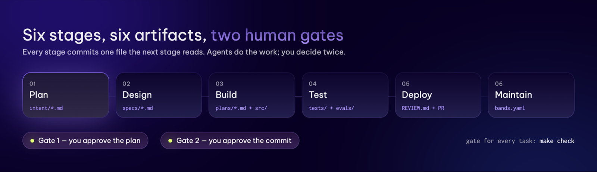
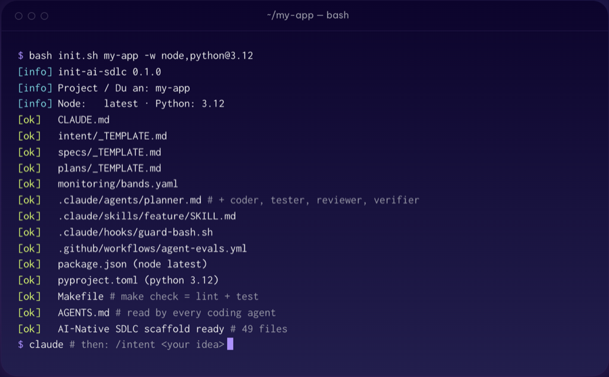

<div align="center">

# AI-Native SDLC Starter

### One command. Six stages. Two human gates.

Scaffold a project that runs Anthropic's [AI-Native SDLC playbook](https://claude.com/blog/the-ai-native-sdlc-playbook) —
with the Claude Code agents, skills and guardrail hooks that drive the loop,
and a stack that builds, tests and lints itself from the first commit.

[](https://github.com/Niseel/ai-sdlc-starter/actions/workflows/scaffold-test.yml)
[](https://github.com/Niseel/ai-sdlc-starter/releases)
[](LICENSE)
[](https://github.com/Niseel/ai-sdlc-starter/actions/workflows/scaffold-test.yml)

**[Open the guide →](https://niseel.github.io/ai-sdlc-starter/)**



</div>

## Install

```bash
curl -fsSL https://niseel.github.io/ai-sdlc-starter/init.sh | bash -s -- my-app -w node
```

```powershell
irm https://niseel.github.io/ai-sdlc-starter/init.ps1 -OutFile init.ps1
powershell -ExecutionPolicy Bypass -File .\init.ps1 my-app -With node
```

`-w node` · `python` · `go` · `java`, pinned with `@` (`-w python@3.11`), comma separated.
Pin the scaffolder itself by swapping the URL for a tag:
`raw.githubusercontent.com/Niseel/ai-sdlc-starter/v0.2.0/init.sh`.

> Versions get pinned; runtimes never get downloaded — that is [mise](https://mise.jdx.dev)'s job.
> Re-running skips what exists unless you pass `--force`. `-h` lists every option.
>
> VI: Một lệnh dựng khung dự án theo AI-Native SDLC của Anthropic. Script chỉ ghim
> phiên bản, không tải runtime. Hướng dẫn đầy đủ ở [trang giới thiệu](https://niseel.github.io/ai-sdlc-starter/).

## What lands in your project



```
intent/ specs/ plans/   one artifact per stage
src/ tests/ evals/      code, tests, agent evals
Makefile                make check = lint + test
AGENTS.md CLAUDE.md     one contract, every agent
REVIEW.md monitoring/   review policy, alert bands
.claude/                5 agents · 4 skills · 4 hooks
```

Real commands, not placeholders: `make check` runs vitest, pytest, `go test` or
Maven — whichever runtimes you picked — and **fails** when the code is broken.
CI proves that on every push.

Then, in Claude Code:

```
/intent Add password reset        → intent/reset-password.md
/spec intent/reset-password.md    → specs/reset-password.md
/feature specs/reset-password.md  → plan → code → test → review
```

Nothing is pushed for you. You approve the plan, then the commit.

## This repo

| Path | What it is |
|---|---|
| [`init.sh`](init.sh) · [`init.ps1`](init.ps1) | the scaffolders — byte-identical output, checked on Linux, macOS and Windows |
| [`index.html`](index.html), `assets/` | the landing page |
| `design-system/` | tokens and rules every page here is built from |
| `.claude/skills/` | `design-system`, `extract-design` |
| [`docs/AGENT-READINESS.md`](docs/AGENT-READINESS.md) | what the stacks still miss, and the plan |

[Ideas and bug reports →](https://github.com/Niseel/ai-sdlc-starter/issues) · MIT
